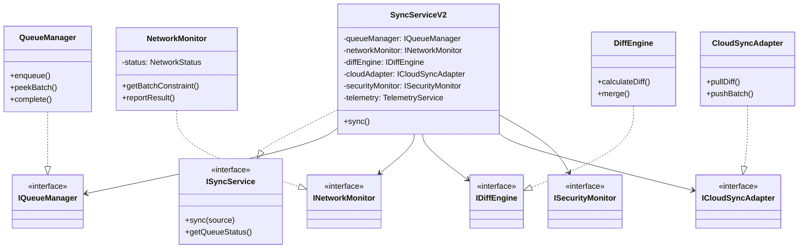

# Phase 2 アーキテクチャ仕様書

## 概要

本ドキュメントは、Phase 2「本番スケール対応」において再設計された同期システムのアーキテクチャを定義します。
従来のモノリシックな `SyncService` を解体し、関心の分離（Seperation of Concerns）と依存性逆転（DIP）を適用した**堅牢で可観測性の高い構成**とします。

---

## 🏗️ コンポーネント構成図

---

## 🧩 各コンポーネントの責務

### 1. SyncServiceV2 (Orchestrator)

- **役割**: 全体の指揮・監督。
- **責務**:
  - 同期フローの制御
  - コンポーネント間のデータ受け渡し
  - エラーハンドリングの最上位処理
  - 依存コンポーネントのライフサイクル管理は行わない（DIで受け取るのみ）

### 2. NetworkMonitor (Environment Awareness)

- **役割**: ネットワークとデバイスの状態監視。
- **責務**:
  - 実測値（成功率、所要時間）に基づく `NetworkStatus` の決定
  - 状態遷移のヒステリシス制御（チャタリング防止）
  - 現在の状態に応じた `BatchConstraint`（並列数、バッチサイズ）の提供

### 3. QueueManager (Persistence & Ordering)

- **役割**: タスクの永続化と順序保証。
- **責務**:
  - LocalDB (Dexie) へのアクセス隠蔽
  - FIFO順序の保証
  - リトライ回数の管理とBackoff制御
  - 優先度（Critical > Low）に基づく取り出し

### 4. DiffEngine (Pure Logic)

- **役割**: データの比較とマージ。
- **責務**:
  - 副作用のない純粋関数としての実装
  - フィールド単位の差分検出
  - LWW (Last Write Wins) 戦略に基づく競合解決
  - データ整合性チェック

### 5. CloudSyncAdapter (I/O Abstraction)

- **役割**: 外部バックエンドとの通信。
- **責務**:
  - Firestore SDK への依存隠蔽
  - バッチ書き込みの実行
  - 差分クエリの実行
  - 通信エラーの統一的なErrorオブジェクトへの変換

### 6. TelemetryService (Observability)

- **役割**: システムの可視化。
- **責務**:
  - 構造化ログの出力
  - SLIメトリクス（System/UX）の収集と集計
  - トランザクションパフォーマンスの計測
  - フォールバック発生状況の追跡

### 7. SecurityMonitor (Safety & Trust)

- **役割**: セキュリティ異常の監視と防御。
- **責務**:
  - Firestore (`users/{userId}`) のメタデータおよび通知サブコレクションのリアルタイム監視
  - リスクスコアに基づくUI制限（ロック、警告）のトリガー発火
  - セキュリティイベントの既読化（Dismiss）処理の管理

---

## 🛡️ 設計原則

### 1. 依存性逆転の原則 (DIP)
- 上位モジュール（SyncServiceV2）は下位モジュール（QueueManager等）に依存しない。両者は抽象（Interface）に依存する。
- これにより、単体テスト時のモック差し替えを容易にする。

### 2. フェイルセーフ (Fail-Safe)
- 差分同期や最適化処理が失敗した場合、**安全な側（フル同期、低速モード）** に倒れる。
- 失敗は静かに無視せず、必ずTelemetryに記録する。

### 3. 人間中心設計 (Human-Centric)
- ユーザーの明示的な操作（Pull-to-refresh等）は、システム都合の最適化（省電力、バックグラウンド制限）よりも常に優先される。

---

**作成日**: 2026-01-31  
**バージョン**: 2.0  
**適用範囲**: Phase 2以降の同期システム全般
