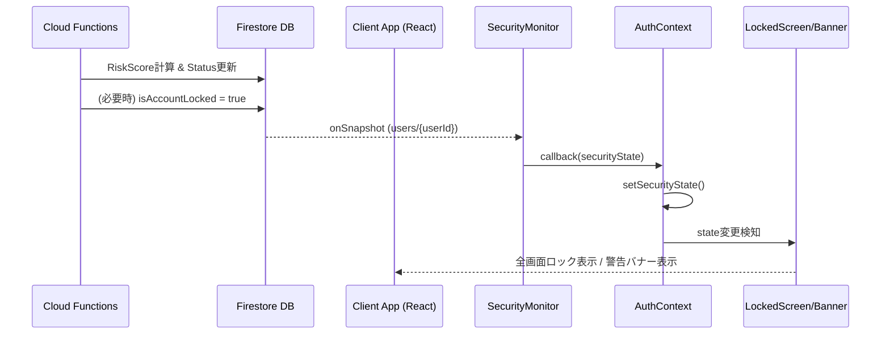

# クライアントサイドセキュリティ設計仕様書

## 1. 概要
本アプリでは、バックエンドで検知されたセキュリティリスクをクライアントサイドにリアルタイムに反映し、UIレベルでの制御（ロック、警告）とデータ同期の制御を行います。これにより、不正アクセスや異常な同期操作からユーザーデータを保護します。

## 2. アーキテクチャ

### 2-1. データフロー


### 2-2. コンポーネント構成

#### SecurityMonitor (`src/services/logic/SecurityMonitor.ts`)
*   **責務**: Firestoreのセキュリティ関連データのリアルタイム監視。
*   **監視対象**:
    *   `users/{userId}`: `isAccountLocked`, `requires2FA`
    *   (通知): 将来的には `notifications` サブコレクションも統合
*   **提供メソッド**:
    *   `startMonitoring(callback)`: 監視開始。
    *   `stopMonitoring()`: 監視終了。

#### AuthContext (`src/contexts/AuthContext.tsx`)
*   **責務**: アプリケーション全体のステート管理。
*   **State定義**:
    ```typescript
    interface SecurityState {
      isLocked: boolean;   // アカウントロック状態
      requires2FA: boolean; // 2FA要求 (次回ログイン時等)
      alerts: any[];       // 表示すべき警告メッセージ
    }
    ```
*   **動作**: `SyncService` 経由で `SecurityMonitor` を初期化し、Global Stateとして公開。

#### SyncServiceV2 (`src/services/SyncServiceV2.ts`)
*   **責務**: `SecurityMonitor` のライフサイクル管理と、インターフェース `ISyncService` の実装。

## 3. UI仕様

### 3-1. アカウントロック画面 (`AccountLockedScreen`)
*   **トリガー**: `securityState.isLocked === true`
*   **表示位置**: `App.tsx` の最上位レベル（ルーティングの外側）。
*   **挙動**:
    *   全画面をオーバーレイで覆う。
    *   操作を一切受け付けない (スクロール、クリック不可)。
    *   「アカウントがロックされました。管理者に問い合わせてください」等のメッセージを表示。
    *   強制ログアウトボタンを配置（オプション）。

### 3-2. セキュリティ警告バナー (`SecurityAlertBanner`)
*   **トリガー**: `securityState.alerts.length > 0` かつ `isLocked === false`
*   **表示位置**: `Layout.tsx` の `main` コンテンツ上部。
*   **挙動**:
    *   Warningレベルのアラートを表示。
    *   閉じるボタンで非表示可能（セッション内一時非表示）。

## 4. セキュリティルールと同期制御

### 4-1. クライアント側の同期停止
*   アカウントロック時は、バックエンド側でFirestore/Storageのルールにより書き込みが拒否されるが、クライアント側でも無駄なリクエストを防ぐため、`SyncService` は同期キューの処理を停止すべきである（※現状はサーバーエラーとして処理されるため、将来的な最適化ポイント）。

### 4-2. Firestore セキュリティルール連携
*   `functions` 側で `isAccountLocked` がセットされると、Firestore セキュリティルールにより、当該ユーザーの書き込み権限が即座に剥奪される設計となっている（Phase 1実装済み）。

## 5. デバッグ・運用
*   **検証**: `scripts/verify_security_signal.ts` を用いたシグナル伝播テスト。
*   **強制解除**: Firebase Console から `isAccountLocked` フィールドを直接編集することで緊急解除が可能。
