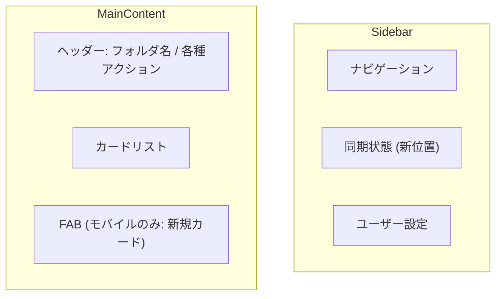

# フォルダ画面UI改善計画（重なり解消とモバイル新規ボタン追加）

フォルダ画面において、同期ステータス表示が「新規カード」ボタンと重なってしまう問題を修正し、モバイル環境での利便性を向上させます。

## 問題の現状

1. **要素の重なり**: `Layout.tsx` で `fixed` 配置されている同期インジケーターが、`FolderView.jsx` のヘッダーボタン（新規カード）と重なる場合がある。
2. **モバイルの欠落**: モバイル表示では「新規カード」ボタンが非表示になっており、カード作成の動線が不足している。

## 提案する変更

### 1. [FolderView.jsx](file:///c:/FlashcardMaster/src/Pages/FolderView.jsx)
- **ヘッダーレイアウトの調整**: デスクトップ表示において、右側のボタン群（新規カード、学習開始）に十分な `margin-right` を追加するか、同期インジケーター（Layout.tsxで配置されているもの）を避けるようにコンテナ全体の余白を調整します。
- **モバイル向けFABの追加**: 以前の計画通り、画面右下に「新規カード」作成用のFAB（Floating Action Button）をモバイル限定で追加します。これにより、モバイルでの操作性が大幅に向上します。

### 2. [Layout.tsx](file:///c:/FlashcardMaster/src/Layout.tsx)

- 同期インジケーターの移動は行わず、現状の `fixed` 位置を維持します。

## 修正後のレイアウトイメージ (Mermaid)

## 検証プラン

### 自動テスト
- `npm run build` を実行し、構文エラーや型エラーがないことを確認。

### 手動検証

1. **デスクトップ表示**:
   - 画面幅を伸縮させても、同期インジケーターがヘッダーボタンと重ならないことを確認。
   - サイドバー下部で同期状態が正しく表示されることを確認。
2. **モバイル表示**:
   - 画面右下にFABが表示され、タップするとカード作成ダイアログが開くことを確認.
   - ヘッダー部分がスッキリし、他のボタン（同期トグル等）と干渉しないことを確認。
