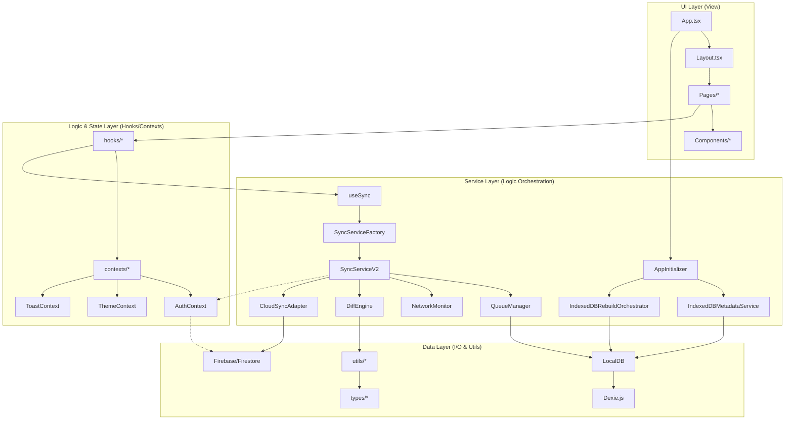

# 依存関係マップ

現在のプロジェクト（FlashcardMaster）における主要なコンポーネント、サービス、およびデータフローの依存関係を以下のレイヤー構造で整理しました。

## 全体俯瞰図 (Mermaid)

## 各レイヤーの役割

### 1. UI Layer (View)
- **App.tsx / Layout.tsx**: ルーティング、グローバルレイアウト、およびアプリ全体の初期化制御を行います。
- **Pages/**: ダッシュボード、フォルダ一覧、学習画面などの大画面単位のコンポーネントです。
- **Components/**: ボタン、ダイアログ、カード表示などの再利用可能な、またはドメイン固有の部品です。

### 2. Logic & State Layer (Hooks/Contexts)
- **Hooks**: UIとロジックを分離するためのカスタムフック群。`useSync`、`useUserSettings` などが含まれます。
- **Contexts**: アプリ全体で共有される状態（認証、テーマ、通知）。特に `AuthContext` は多くのサービスが依存するハブとなっています。

### 3. Service Layer (Orchestration)
- **SyncServiceV2**: 同期の中心的なオーケストレーターです。具象クラスには依存せず、インターフェースを介して差分同期ロジック（DiffEngine）やキュー管理（QueueManager）を制御します。
- **AppInitializer**: 起動時のデータ健全性チェックと、必要に応じた IndexedDB の再構築を担当します。

### 4. Data Layer (I/O & Utils)
- **LocalDB (Dexie.js)**: ブラウザ上のデータベース操作を抽象化します。
- **Firebase/Firestore**: クラウド側の永続ストレージ。
- **Utils / Types**: プロジェクト全体で使用される純粋関数と型定義です。

## 主要なデータフロー (同期)
1.  **UI操作**: ユーザーがカードを編集。
2.  **Hook**: `LocalDB.updateItem` が呼ばれ、同時に `SyncQueue` にタスクが追加される。
3.  **Service**: `useSync` (または `App.tsx` の起動タスク) が `SyncServiceV2` を起動。
4.  **Orchestration**: `SyncServiceV2` がオンライン状態（NetworkMonitor）を確認し、キューからタスクを取り出して `CloudSyncAdapter` を介して Firestore へ反映、または `DiffEngine` でリモートの変更を取り込みます。
