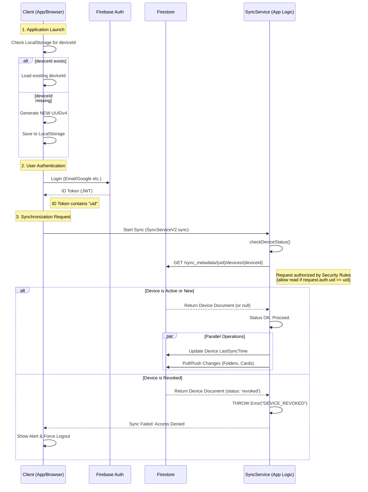
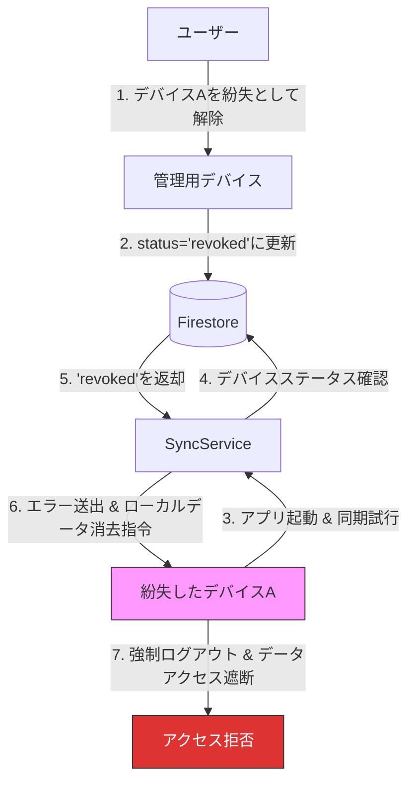

# 認証およびデバイス識別の関係図

## 概要

本システムにおける「ユーザー認証（Authentication）」と「デバイス識別（Device Identification）」の相互関係、およびそれらがどのように連携してデータ同期のセキュリティと整合性を保証しているかを定義します。

## 認証と権限の階層構造

1.  **User Identity (Account)**: 「誰か」を識別。Firebase Auth Tokenによって保証される。
2.  **Device Identity (Client Instance)**: 「どこから」を識別。アプリ側で生成する`deviceId`によって追跡される。

この2層構造により、**「正当なユーザーであっても、無効化された（Revoked）端末からのアクセスは拒否する」** という高度な制御が可能になります。

## シーケンス図: 認証と同期のフロー

## コンポーネント間の関係性

| コンポーネント | 役割 | 保持データ | ライフサイクル |
| :--- | :--- | :--- | :--- |
| **Firebase Auth** | ユーザー本人の正当性を保証 | `uid`, `email` | ログイン 〜 ログアウト/期限切れ |
| **LocalStorage** | クライアントインスタンスの同一性を保持 | `deviceId` | ブラウザデータ削除時まで永続 |
| **Firestore (Devices)** | デバイスの状態管理とアクセス制御ポリシー | `status`, `lastSyncTime` | 登録 〜 論理削除 〜 自動物理削除 |
| **Security Rules** | データアクセス権の最下層ガード | `request.auth.uid` | - |

### セキュリティチェックの2段階防御

1.  **Firebase Security Rules (Layer 1)**:
    *   そのデータにアクセスしようとしているのは、データの所有者本人か？
    *   検証: `request.auth.uid == resource.data.userId`
2.  **Application Logic / Sync Service (Layer 2)**:
    *   その端末は、現在もアクセスを許可されているか？
    *   検証: `device.status !== 'revoked'`

## 異常系シナリオ: 無効化された端末からのアクセス

デバイス管理画面で「登録解除（Revoke）」された端末が、再度アクセスを試みた場合の挙動です。

## 注意点

*   **デバイスIDの再生成**: ユーザーがブラウザのキャッシュをクリアしたり、再インストールを行った場合、`deviceId` は失われ、次回起動時に**新しいデバイス**として認識されます。これはセキュリティ上の仕様（意図された挙動）です。
*   **トークンとデバイスIDの独立性**: Firebaseの認証トークン自体には `deviceId` は含まれません。紐付けはアプリケーションロジック（`SyncService`）によって動的に検証されます。
