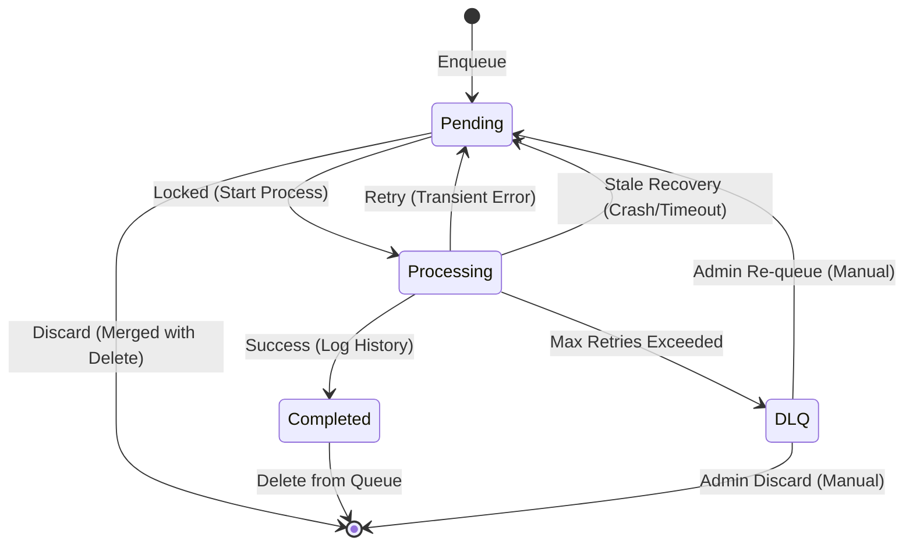

# 同期キュー処理フロー図 (Sync Queue Flowcharts)

`QueueInfrastructureDesign.ts` (Rev.5) および `OperationQueueService` 実装に基づく詳細フロー。

## 凡例 (Legend)

- **[◇ Check]** : 判断・条件分岐
- **[Database]** : データ永続化 (IndexedDB)
- **[Action]** : 処理・計算
- **[End/Error]** : 終了または停止

---

## 1. エンキュー処理フロー (Enqueue & Compression)

「連続する操作」を適切に圧縮し、サーバー負荷と通信回数を最小化するフロー。

```mermaid
flowchart TD
    %% Styles
    classDef db fill:#e1f5fe,stroke:#01579b,stroke-width:2px;
    classDef decision fill:#fff9c4,stroke:#fbc02d,stroke-width:2px;
    classDef process fill:#f3e5f5,stroke:#7b1fa2,stroke-width:2px;
    classDef term fill:#ffebee,stroke:#c62828,stroke-width:2px;
    classDef warning fill:#ffe0b2,stroke:#f57c00,stroke-width:2px;

    Start([Client Action]) --> CheckPending{Is Pending Item Existed?<br/>(Same TargetId)}:::decision
    
    subgraph NewOp ["新規作成フロー (New)"]
        direction TB
        CheckPending -- No --> CreateNew[Create New Item<br/>(Generate New IdempotencyKey)]:::process
    end

    subgraph CompressOp ["圧縮・合成フロー (Compression)"]
        direction TB
        CheckPending -- Yes --> CheckMatrix{Check Operation Matrix<br/>(ExistingType + NewType)}:::decision
    
        CheckMatrix -- Discard --> Discard[Discard Both<br/>(e.g., Create + Delete)]:::term
        
        CheckMatrix -- Error/Unknown --> LogWarn[Log Warning / Metrics]:::warning
        LogWarn --> ForceEnqueue[Force Enqueue New Item<br/>(Safety Fallback)]:::process
        
        CheckMatrix -- Update --> Compress[Compress Item<br/>(Keep Existing IdempotencyKey,<br/>Replace Payload)]:::process
    end
    
    CreateNew --> SaveDB[(Save to IndexedDB<br/>Status: Pending)]:::db
    Compress --> SaveDB
    ForceEnqueue --> SaveDB
    
    SaveDB --> Trigger[Trigger Process]:::process
    Trigger --> End([End]):::term
    Discard --> End
```

### ポイント (Enqueue)

- **Pending判定の厳格化**: 同一 `TargetId` を持つ `Pending` アイテムのみを対象とします。Entity単位ではなくTarget単位で圧縮対象を限定し、誤圧縮を防ぎます。
- **Force Enqueue**: マトリクス定義外の操作や未知の組み合わせは、データ消失を防ぐため「安全側（Safety Fallback）」として別アイテムで強制追加し、警告ログを残します。
  - **Metrics**: 単にログを吐くだけでなく、発生回数やTargetIdの偏りをメトリクスとして集計し、将来的な Matrix 拡張の判断材料とします。

---

## 2. キュー消化処理フロー (Process & Retry)

「安全」「確実」にクラウドへ反映するためのフロー。ブラウザクラッシュ時の孤児対策を含みます。

```mermaid
flowchart TD
    %% Styles
    classDef db fill:#e1f5fe,stroke:#01579b,stroke-width:2px;
    classDef decision fill:#fff9c4,stroke:#fbc02d,stroke-width:2px;
    classDef process fill:#f3e5f5,stroke:#7b1fa2,stroke-width:2px;
    classDef term fill:#ffebee,stroke:#c62828,stroke-width:2px;
    classDef cloud fill:#e0f2f1,stroke:#00695c,stroke-width:2px,stroke-dasharray: 5 5;
    classDef reaper fill:#ffccbc,stroke:#d84315,stroke-width:2px;

    Trigger([Trigger / Periodic]) --> Reaper
    
    subgraph Watchdog ["孤児プロセス監視 (Watchdog/Reaper)"]
        Reaper[Recover Stale Items<br/>(Status=Processing & >5min)]:::reaper
        Reaper -- Found --> Rollback[Rollback to Pending<br/>(Increment Retry)]:::db
        Reaper -- None --> CheckEffective
        Rollback --> CheckEffective
    end

    CheckEffective{Online &<br/>Authenticated?}:::decision
    CheckEffective -- No --> End([End]):::term
    
    CheckEffective -- Yes --> CheckConcurrency{Global Limit Reached?<br/>(Atomic Check)}:::decision
    CheckConcurrency -- Yes --> End
    
    subgraph Fetch ["1. 候補取得 (Cascading Fetch)"]
        CheckConcurrency -- No --> FetchStep[Fetch Candidates<br/>High -> Normal -> Background]:::process
        FetchStep --> HasCandidates{Candidates > 0?}:::decision
    end
    
    HasCandidates -- No --> End
    HasCandidates -- Yes --> LoopStart(For Each Candidate)
    
    subgraph Lock ["2. 排他制御 (Lock)"]
        LoopStart --> LockTx{Transaction Lock<br/>(Compare-and-Swap)}:::decision
        LockTx -- Failed --> NextItem(Next Candidate)
        LockTx -- Success --> MarkProcessing[Update Status: Processing<br/>Update Global Count]:::db
    end
    
    subgraph Exec ["3. 実行 (Execute)"]
        MarkProcessing --> CloudExec(Target Cloud Function):::cloud
    end
    
    subgraph Result ["4. 結果ハンドリング"]
        CloudExec -- Success --> LogHistory[Log to syncHistory]:::db
        LogHistory --> Delete[Delete Item &<br/>Decrement Global Count]:::db
        Delete --> NextItem
        
        CloudExec -- Fail --> CheckRetry{Retry Count < MAX?}:::decision
        
        CheckRetry -- No --> MoveDLQ[Move to DLQ<br/>(syncErrors Table)]:::term
        MoveDLQ --> NextItem
        
        CheckRetry -- Yes --> CalcBackoff[Calc Backoff<br/>(Exp + Jitter)]:::process
        CalcBackoff --> UpdateRetry[Update Status: Pending<br/>Decrement Global Count]:::db
        UpdateRetry --> NextItem
    end
    
    NextItem --> LoopStart
```

### ポイント (Process)

- **Watchdog / Reaper (Design Philosophy)**:
  - 現状は「5分超過」を一律ロールバック対象としています。
  - **将来的な拡張要件**: インポート処理などの長時間実行（Long-running Operation）を実装する場合は、**必ず `heartbeat` 更新機能（処理中に `timestamp` を更新し続ける）を実装すること**を義務付けます。Heartbeat 未対応の処理は、より短いタイムアウト（1分など）で強制回収されるべきです。
- **Concurrency (Atomic)**:
  - 全てのタブで共有される `IndexedDB` 上のカウントに基づく「Global Limit」です。
  - 複数タブからの同時実行を防ぐため、カウントチェックとインクリメントは**アトミックな操作（Transaction内でのみ実施）**である必要があります。単なる Read-Modify-Write はレースコンディションの原因となります。
- **DLQ**: エラーキュー（`syncErrors`）は「隔離室」です。
- **History**: 成功した操作は `syncHistory` テーブルに監査ログとして記録され、実データ（Queue）からは削除されます。

---

## 3. 状態遷移図 (State Machine)

各アイテムのライフサイクル定義。



### Note on Transitions

- **Admin Re-queue**:
  - 管理ツール等から手動で再実行する場合、以下の手順を厳守します。
    1. 新しい `IdempotencyKey` を再発行する（過去の失敗と分離するため）。
    2. `retryCount` を 0 にリセットする。
    3. 元の `syncErrors` レコードへの参照（Lineage）を保持する（任意）。

---

## 4. 補足：操作合成マトリクス (Operation Matrix)

このマトリクスは **Versioned (Rev.1)** であり、将来的な操作タイプ追加時に拡張される可能性があります。未知の組み合わせはすべて **Error (Unknown)** として扱われます。

| Existing \ Incoming | Create | Update | Delete |
| :--- | :--- | :--- | :--- |
| **Create** | Error (Force New) | **Create** (Merge) | **Discard** (Both) |
| **Update** | Error (Force New) | **Update** (Merge) | **Delete** (Replace) |
| **Delete** | **Update** (Resurrect) | Error (Force New) | Error (Ignore) |

- **Merge**: Payloadを合成し、既存のIDを維持。
- **Replace**: 操作タイプを変更し、Payloadを入れ替え。
- **Resurrect**: 削除予定だったものを更新操作として復活。
- **Error (Ignore)**: 「削除済みのものを削除」する操作。
  - **重要**: この操作を Ignore (No-op) とするためには、**「サーバー側の Delete 操作が完全に冪等であり、既に存在しないリソースに対する Delete も成功（200 OK）として扱う」**という前提が必須です。
  - キューには追加せず、UI上も成功として扱います。
