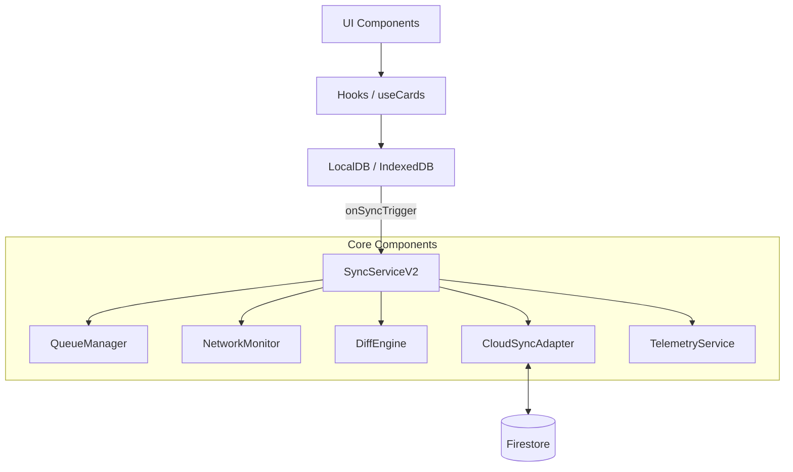

# 同期・競合制御システム仕様書 (Master Specification v2.1)

**最終更新**: 2026-02-03
**バージョン**: 2.1 (Local-First Centric)
**統合元ドキュメント**:
- `同期システム仕様書 (v2.0)`
- `カード保存不可不具合の調査報告書`: 保存の堅牢性向上
- `実装完了レポート`: Phase 2 最終統合結果

---

## 1. 概要 (System Overview)

本システムは、FlashcardMaster の核となる「データ同期」「競合解決」「オフライン動作」を司る基盤システムです。
V2.1 では、**「IndexedDB を唯一の信頼できるデータソース（Single Source of Truth）」** とし、クラウドとの同期を完全に疎結合かつ非同期な背景プロセスとして位置づけています。

### 1.1 設計思想: "Local-First, Sync-Second"

- **Local-First**: ユーザーの操作（保存・更新・削除）は常にローカルDBに対して即座に完結し、UIをブロックしません。
- **Automated Enqueuing**: `LocalDB.ts` の操作メソッドがフックされ、自動的に `syncQueue` へタスクを積みます。
- **Resilient Startup**: アプリ起動時に「前回同期以降の差分」を確実に Pull することで、デバイス間のデータ不整合を防止します。

---

## 2. アーキテクチャ詳細 (Core Architecture)

### 2.1 データフロー

1.  **ユーザー操作**: UI -> `useCards` / `useFolders` -> `LocalDB`
2.  **永続化 & エンキュー**: `LocalDB` が IndexedDB に書き込み、同時に `syncQueue` に `Upload` タスクを追加。
3.  **トリガー**: `LocalDB` が `syncTrigger` を発火し、`SyncServiceV2` を起動。
4.  **同期実行**: `SyncServiceV2` がバッチ処理で Firestore への書き込み（Push）や差分の取得（Pull）を実行。

### 2.2 起動時同期フロー (`performStartupSync`)

アプリ起動直後に以下のステップで動作します：
1.  **Pull First**: クラウド上の最新変更を検知し、ローカルに適用（競合時は `server_wins`）。
2.  **Push Second**: オフライン中に発生したローカルの未同期タスクをクラウドへ送信。
3.  **Checkpoint**: 全て成功した場合にのみ、最終同期時刻を更新。

---

## 3. コンポーネント構成 (Dependency Injection)

`SyncServiceV2` をオーケストレーターとし、以下のコンポーネントが協調動作します。

---

## 4. 競合解決戦略

V2.1 でのデフォルト動作は以下の通りです：
- **Strategy**: `server_wins` (Last Write Wins)
- **Conflict Table**: 競合が検知された場合、マージ後のデータは保存されますが、詳細が `conflicts` テーブルに記録されます。
- **Manual Resolution**: 将来的には、この `conflicts` テーブルを基にユーザーが手動マージを行う UI を提供します。

---

## 5. 運用と監視 (Operations)

### 5.1 同期キューの健全性
- `syncQueue` の深さを監視し、定常的に 100 を超える場合はネットワークまたはサーバー側の遅延を疑います。
- `LocalDB` の `addItem` 等で発生する例外は、データの損失（保存不可）に直結するため、`TelemetryService` で最優先のアラート対象とします。

---
**作成日**: 2026-02-03
**ドキュメント分類**: 統合仕様書
